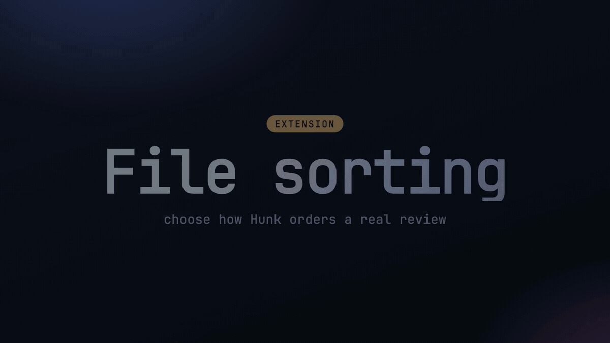

# hunk-file-order

Choose the order of files in a [Hunk](https://github.com/modem-dev/hunk) review.



## Why

I use Hunk and [Lazygit](https://github.com/jesseduffield/lazygit). I would
review a change in one, switch to the other, and lose my place because the same
files appeared in a different order. This extension gives Hunk a few useful
orders, including Lazygit's `mixed` order.

## Sort order

| Value | Order |
| --- | --- |
| `mixed` | Default. Files and folders sort together. Matches Lazygit's `mixed` order. |
| `filesFirst` | Files before folders at each level. |
| `foldersFirst` | Folders before files at each level. |
| `hunk` | Keep Hunk's native order. |

Extension sorts keep tracked files above untracked files.

## Configure

Add this to `~/.config/hunk/config.toml` or `.hunk/config.toml`:

```toml
[extension.hunk-file-order]
sortOrder = "mixed"      # hunk | mixed | filesFirst | foldersFirst
caseSensitive = true
```

The defaults are `mixed` and case-sensitive sorting.

With `caseSensitive = false`, the extension uses JavaScript `toLowerCase()`.
Some uncommon Unicode names may sort differently in other tools.

## Install

```sh
hunk extension install astwys/hunk-file-order
```

To try a checkout without installing it:

```sh
hunk diff --extension /path/to/hunk-file-order
```

## Notes

Hunk does not expose merge-conflict state to changeset transforms. Conflicted
files therefore sort with the other tracked files.

## Development

```sh
pnpm install
pnpm test
pnpm typecheck
pnpm dev
```
